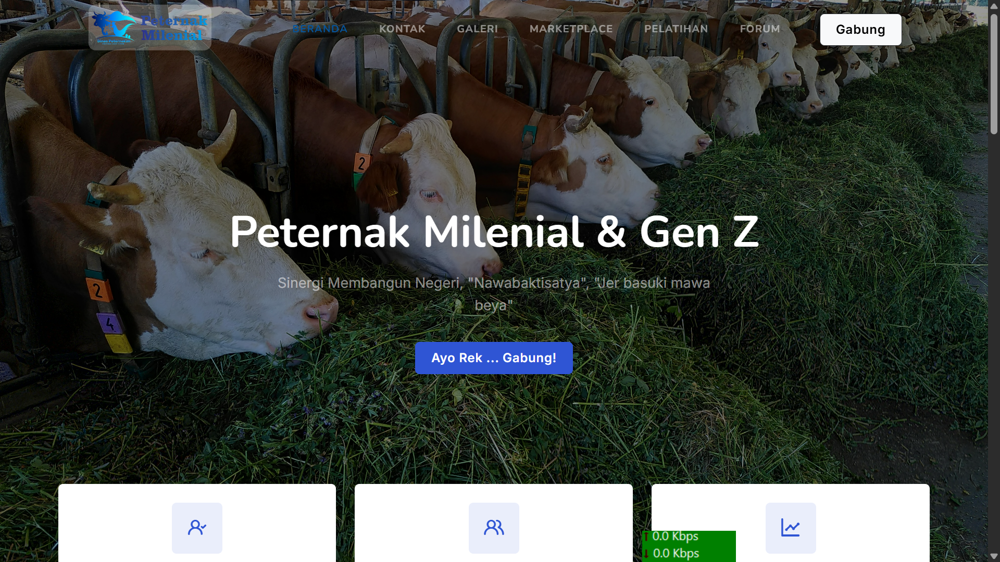
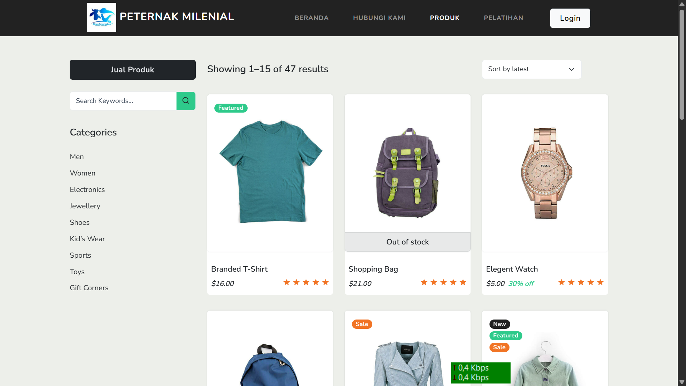

<p align="center"><a href="https://laravel.com" target="_blank"></a></p>

## Peternak Milenial

**Peternak Milenial** adalah sebuah platform dimana peternak sebagai user dapat menjual hasil ternaknya, belajar mengelola peternakan dan berdiskusi dalam sebuah forum dengan sesama peternak. Aplikasi ini dibuat oleh Dinas Peternakan Jawa Timur dan bekerjasama dengan PT Abdar Java Indo.

<p align="center">
    
    
</p>

## Default Credential

```
User: user@gmail.com
Pass: password

User: admin@gmail.com
Pass: password

```

## Prerequisites

-   PHP 8.1 ke atas
-   Node 14.16
-   Composer 2.7

## Installation

1. Download or clone project
2. Go to the folder application using cd
3. Run `composer install` on your cmd or terminal
4. Copy .env.example file to .env on root folder. You can type `copy .env.example .env` if using command prompt Windows or `cp .env.example .env` if using terminal Ubuntu
5. Open your .env file and change the database name (DB_DATABASE)
6. Run `php artisan key:generate`
7. Clear your config cache

```
 php artisan optimize:clear
 # or
 php artisan config:clear
```

8. Run `php artisan migrate --seed`
9. To create a link from the storage directory, run the following command from the project root:

```
php artisan storage:link
```

10. Run `php artisan serve` to running your app in browser

_After creating the new permissions use the following commands to update cashed permissions (optional)._

`php artisan cache:forget spatie.permission.cache`

11. Upload file mysql `wilayah.sql` ke tabel wilayah

## Yang perlu diperhatikan

-   Menu Kursus = Pelatihan
-   Menu Tokoku = Etalaseku
-   Tabel kategori_produks = Komuditas
-   Cronjob = http://peternak-milenial.test/run-course-checker?token=NnbQGG6KBptT2001

## Yang perlu dibenahi
